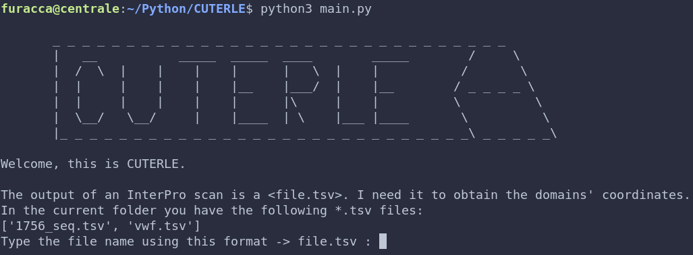
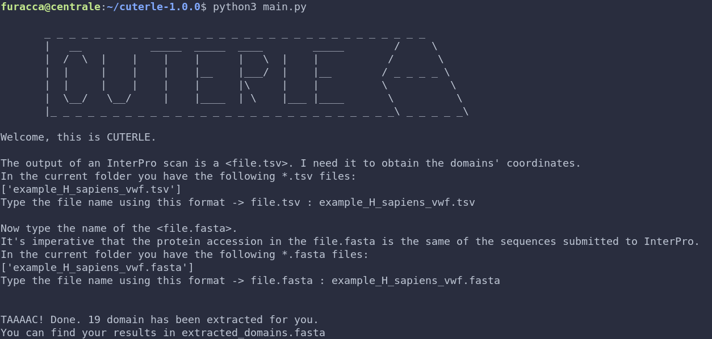
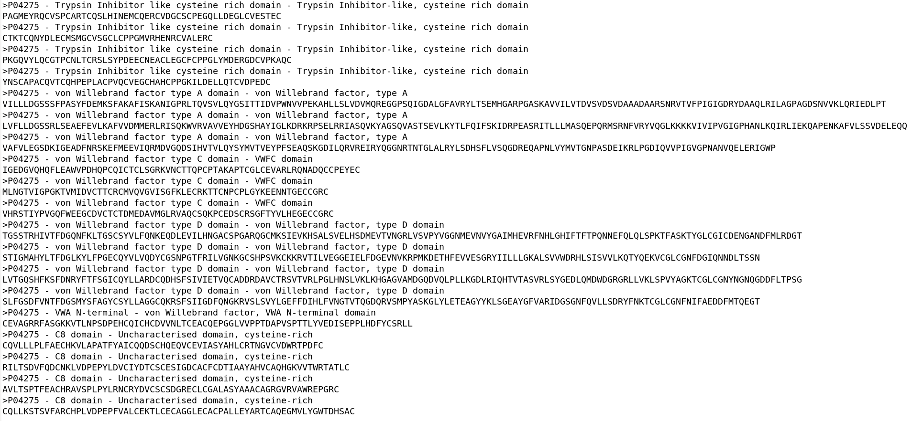

<h4 align ="center">

       _ _ _ _ _ _ _ _ _ _ _ _ _ _ _ _ _ _ _ _ _ _ _ _ _ _ _ _ _ _ _ 
       |   __           _____  _____  ____        _____        /     \\
       |  /  \  |    |    |    |      |   \  |    |           /       \\
       |  |     |    |    |    |__    |___/  |    |__        / _ _ _ _ \\
       |  |     |    |    |    |      |\     |    |          \          \\
       |  \__/   \__/     |    |____  | \    |___ |____       \          \\
       |_ _ _ _ _ _ _ _ _ _ _ _ _ _ _ _ _ _ _ _ _ _ _ _ _ _ _ _\ _ _ _ _ _\\
</h4>

<h1 align = "center"> Cuterle </h1>
<p align = "center"><i> Cuterle is a bioinformatic tool which return an output file (`extracted_domain.fasta`) containing every domain annotated by [InterProScan](https://www.ebi.ac.uk/interpro/) (`~.tsv file`) via Pfam or SMART from the list of protein (`~.fasta file`) submitted. </i></p>

# Cuterle
Cuterle is a bioinformatic tool which return an output file (`extracted_domain.fasta`) containing every domain annotated by [InterProScan](https://www.ebi.ac.uk/interpro/) (`~.tsv file`) via Pfam or SMART from the list of protein (`~.fasta file`) submitted.

## Getting started

### Prerequisites

- Python3
- pip

### Installation of the Python required packages

Install the required Python packages; while you are in the project's root directory run the following command:

```bash
# Install requirements
pip install -r requirements.txt
```

# Usage

In terminal, run the following command. By default, this will only retrieve Bulbasaur.

```bash
# Run Cuterle
python3 main.py
```



## Example of interaction with Cuterle

Once you run main.py in terminal, the program request the two input file (~.tsv and ~.fasta)



Output from the inputs above (extracted_domains.fasta)




## Next possible feature
Sorted randomly, here we have the next possible feature of Cuterle:

TOP PRIORITY
- Enable python argument command line to be bash script friendly (work in progress)

OTHER

- Nicer interface (only at the end)
- Draw a schematic protein with the domains draw up (potentially done)
- List all the domain extracted in decrescent order (done)
- Possibily of choice for the order of domain (decrescent order for number of domain or for the id?)
- Sort the domain extracted for each sequence in crescent order
- Choice the domain of interest to be saved in the output file
- Print max 10 item from the files' list in the folder

- Maybe a folder "Input/Output" or "Workinprogress" to save every files

