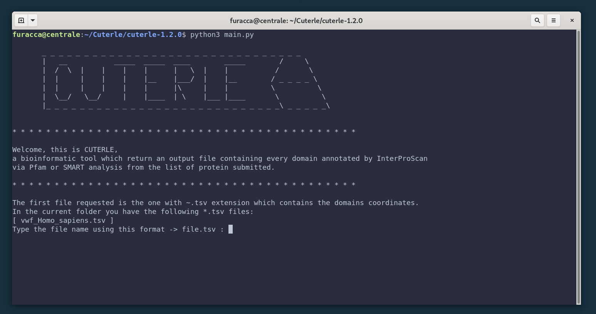
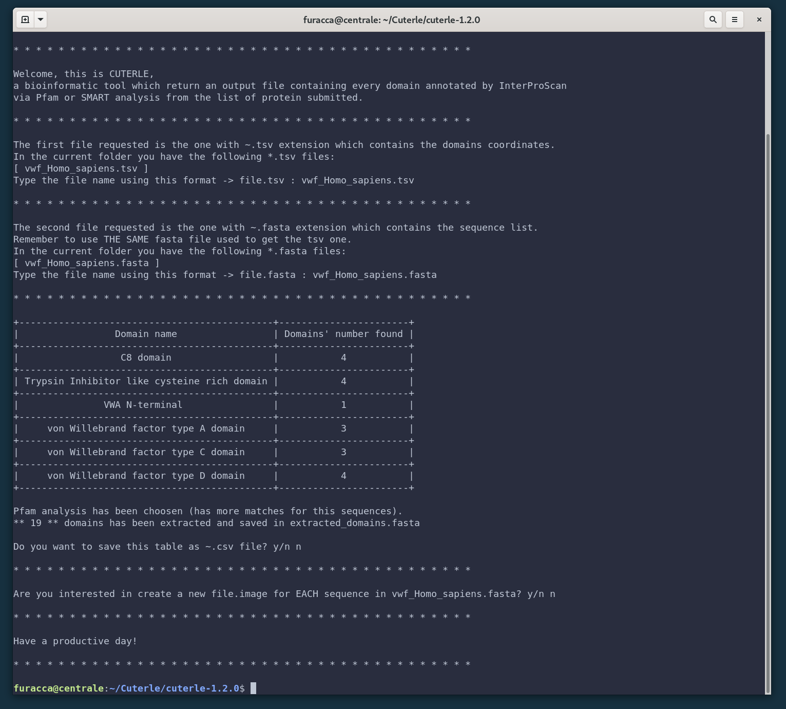
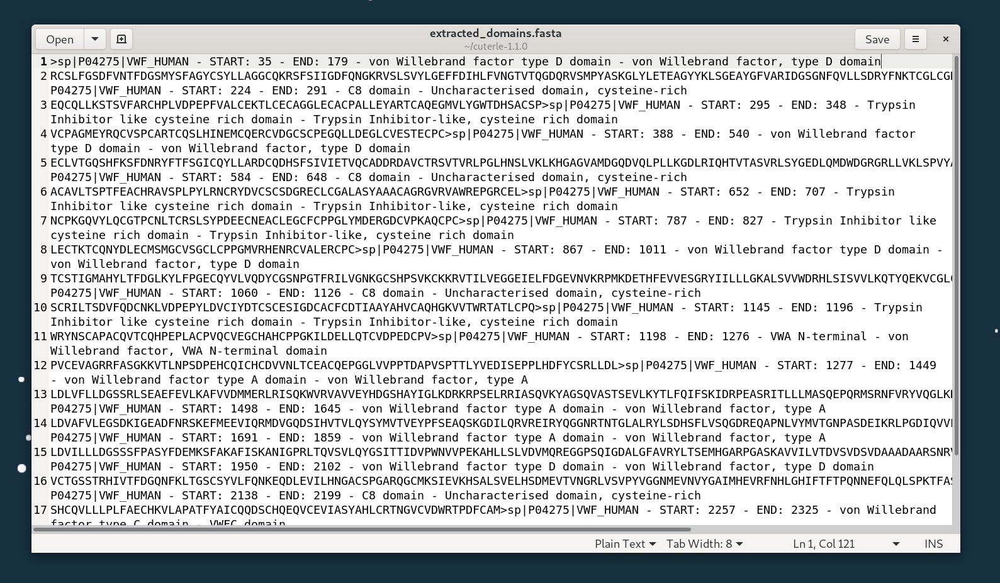
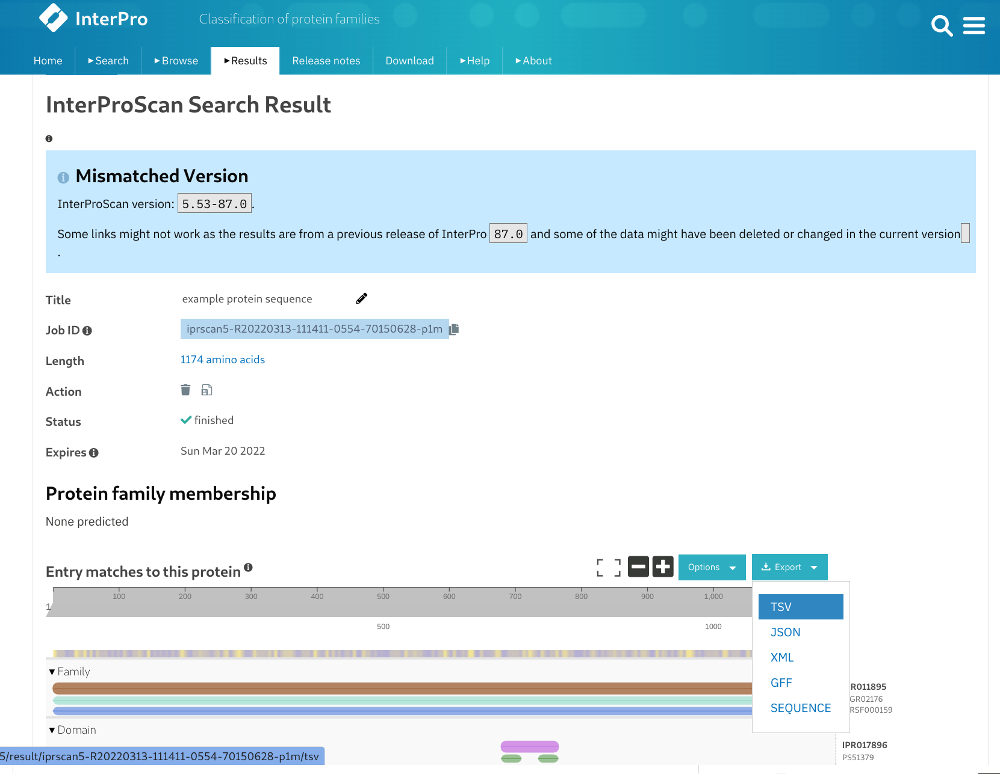

<p align="center"></p>

# Cuterle
Cuterle is a bioinformatic tool which return an output file (`extracted_domain.fasta`) containing every domain annotated by [InterProScan](https://www.ebi.ac.uk/interpro/) (`~.tsv file`) via Pfam or SMART from the list of protein (`~.fasta file`) submitted.


**Index**
- [Getting started](#getting-started)<br>
- [Usage](#usage)<br>
- [Output example - Fasta list](#output-example---fasta-list)<br>
- [Output example - Sequence's draw](#output-example---sequences-draw)<br>
- [How to get a ~.tsv file](#how-to-get-a-tsv-file)<br>
- [Next updates](#next-updates)<br>

## Getting started

### Prerequisites

- Python3
- pip

### Installation of the Python required packages

Install the required Python packages; while you are in the project's root directory run the following command:

```bash
# Install requirements
pip install -r requirements.txt
```

### Usage

In terminal, run the following command. <br>
By default, the program will run the assisted mode (no, there isn't (still) a bash scriptable mode, see [Next updates](#next-updates)).

```bash
# Run Cuterle
python3 main.py
```




Once you run main.py in terminal, the program request the two input file (~.tsv and ~.fasta).<br>
For every input file there is a check which guarantee its existence and the right format. <br>
**Please be sure to use the right format**

If you are not sure about how getting the tsv file follow [How to get a ~.tsv file](#how-to-get-a-tsv-file)



## Output example - Fasta list

All the extracted domains have the follow syntax:<br>
- First line: `>{1} - START: {2} - END: {3} - {4} - {5}` 
- Second line: the sequence

Where:
 - {1} - Protein accession (e.g. P51587)
 - {2} - Start location of the domain
 - {3} - End location of the domain
 - {4} - Signature accession (e.g. PF09103 / G3DSA:2.40.50.140)
 - {5} - InterPro annotations - description (e.g. BRCA2 repeat)

At the moment it's possibile to change the syntax only by editing the code. (see: [Next updates](#next-updates))




## Output example - Sequence's draw
It's so bad, that's so good. There will be a lot (one or two) of updates for the drawing option. See [Next updates](#next-updates).


## How to get a ~.tsv file
There are two main way to get an tsv file from InterPro:
1) Follow the <a href="https://interproscan-docs.readthedocs.io/en/latest/Introduction.html#to-install-and-run-interproscan" target="_blank">InterProScan guide</a> to install it on some local machine
2) Use the official <a href="https://www.ebi.ac.uk/interpro/">InterProScan website</a> to submit the fasta fasta file and obtein the tsv file (like in the screenshot below):


## Next updates
Almost certainly not all in one go.

**TOP PRIORITY**
- Enable python argument command line to be bash script friendly (in the next update)

**MEDIUM PRIORITY**
- Use some nice color to draw the domains (same domain, same color)
- Change the way to write down the domains's name (label with the same color of the domain)

**OTHER**
- Possibily of choice for the name's format of sequences in fasta output
- Possibily of choice for the order of domain (decrescent order for number of domain or for the id?)
- Choice the domain of interest to be saved in the output file
- Print max 10 item from the files' list in the folder
- Nicer interface (only at the end)


