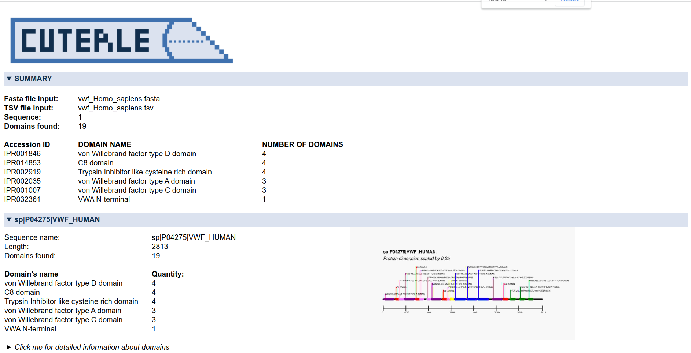
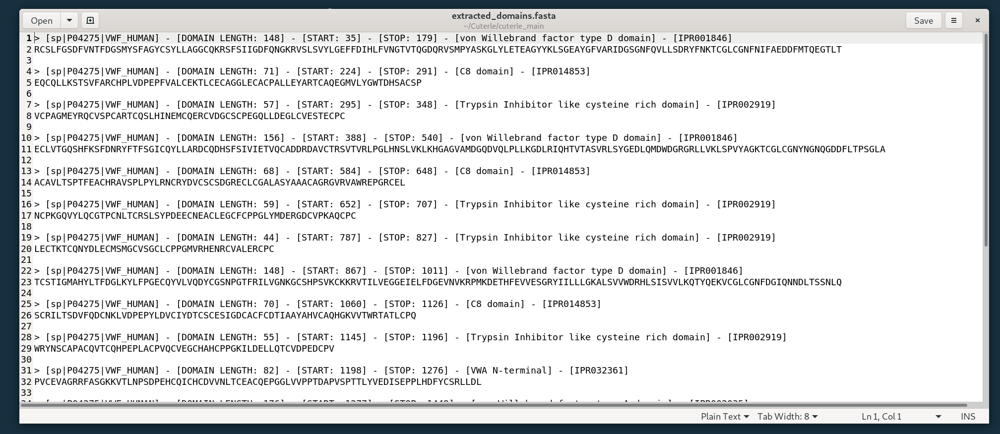
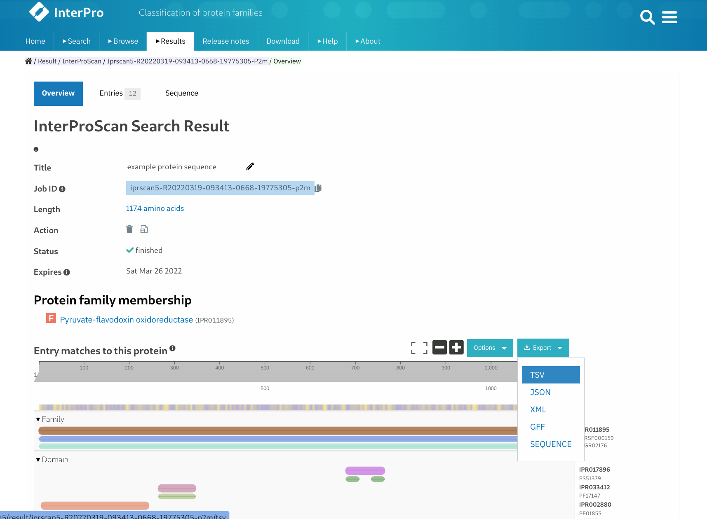

<p align="center"></p>


[//]: # (da aggiornare)
# Cuterle
Cuterle is a bioinformatic tool which creates an output file (`extracted_domain.fasta`) 
containing every domain annotated by [InterProScan](https://www.ebi.ac.uk/interpro/) (`~.tsv file`) 
from the list of protein (`~.fasta file`) submitted.


Cuterle uses two main analysis of InterPro (there are also <a href="https://interproscan-docs.readthedocs.io/en/latest/HowToRun.html#included-analyses">others analysis</a>):
- Pfam (XX.X) : A large collection of protein families, each represented by multiple sequence alignments and hidden Markov models (HMMs)
- SMART (X.X) : SMART allows the identification and analysis of domain architectures based on Hidden Markov Models or HMMs

Cuterle chooses **for every protein** the analysis with more results.
<br>
<br>
Running the **manual mode** there will be one output folder with this structure:
<br>
<br>
`YYYY/MM/DD_Analysis_number_X:` **Directory** which cointains the sequences_draw images scaled to be light to load in the browser
<br>
<br>
&nbsp;&nbsp;&nbsp;&nbsp;&nbsp;`- sequences_draw` **Directory** containing the sequences_draw images (created via -draw_image option)
<br>
<br>
&nbsp;&nbsp;&nbsp;&nbsp;&nbsp;`- domains_list.csv` **~.csv file** reporting how many times every domains has been found
<br>
<br>
&nbsp;&nbsp;&nbsp;&nbsp;&nbsp;`- extracted_domains.fasta` **~.fasta file** containing every domains extracted
<br>
<br>
&nbsp;&nbsp;&nbsp;&nbsp;&nbsp;`- graphical_output.html` **~.html file** granting browsable graphical output
<br>
<br>
<br>

**Index**
- [Suggested use](#suggested-use)<br>
- [Limitations](#limitations)<br>
- [Getting started](#getting-started)<br>
- [Usage - Manual mode](#usage---manual-mode)<br>
- [Examples manual mode syntax](#examples-manual-mode-syntax)<br>
- [Usage - Assisted mode](#usage---assisted-mode)<br>
- [Usage - Graphical mode](#usage---graphical-mode)<br>
- [Output example - HTML_file](#output-example---HTML-file)<br>
- [Output example - Fasta list](#output-example---fasta-list)<br>
- [Output example - Sequence's draw](#output-example---sequences-draw)<br>
- [How to get a ~.tsv file](#how-to-get-a-tsv-file)<br>
- [Log](#log)<br>
- [Next updates](#next-updates)<br>

## Suggested use
This program has been thought as **Quality of Life tool** for extracting the domains.
<br>
<br>
<i> **Exempli gratia**</i><br>
I want to extract a specific domain (IPR002035) from transcriptome:
1) Download the transcriptome's target obtaining an `trascriptome.fasta` file
2) Run InterProScan analysis against the transcriptome obtaining an `transcriptome_result.tsv` file: <br>`./interproscan.sh -o ./transcriptome_result.tsv -i ./transcriptome.fasta -f tsv -dp`
3) Run Cuterle:<br>`python3 main.py -m -tsv transcriptome_result.tsv -fasta transcriptome.fasta -accession IPR002035`
4) Be happy with your `extracted_domains.fasta` result file

Thanks to the arguments option, the point 2 and 3 are scriptable, saving **A LOT** of time.<br>
(Happiness can't be scripted; tough life)

*Post Scriptum*<br>
With multiple transcriptomes to scan you should run an HMMER analysis, creating a reducted fasta list to use in point 2

## Limitations
- This program does nothing more than extracting the domains identified by InterProScan
- Non-canonical domain could be not identified
- This program **has not** been thought to replace software which perform complete protein analysis, like <a href="http://smart.embl-heidelberg.de/">SMART</a> 


## Getting started

### Prerequisites

- Python3
- pip

### Installation of the Python required packages

Install the required Python packages; while you are in the project's root directory run the following command:

```bash
# Install requirements
pip install -r requirements.txt
```

### Usage - Manual mode
From the release 1.2.0 it's available the **manual mode**, making the program script-friendly.

Asking help to the program:

```
python3 main.py -h
```

```
usage: main.py  [options]

-----------------------------------------------------------------
IF NO OPTION IS SELECTED, THE PROGRAM WILL RUN IN [ASSISTED MODE]
-----------------------------------------------------------------
DESCRIPTION

    Cuterle is a bioinformatic tool.
    It returns an output file containing every domain annotated by InterProScan.
    Pfam or SMART analysis are choosen by which method has more matches.

LIST OF OUTPUT FILE

    extracted_domains.fasta - contains every domains extracted
    [optional] domains_list.csv - contains the table's raw data (domain_name,count)
    [optional] domains_view[seq_name].jpg - schematic domains draw FOR EACH sequence

NAME FORMAT
    The name for every sequence added to extracted_domain.fasta is [>1,2,3,4,5,6]

        1 - Protein accession (e.g. P51587)
        2 - Length of the domain (e.g. [DOMAIN LENGHT: (150)])
        3 - Start location of the domain (e.g. [START: 50])
        4 - End location of the domain (e.g. [END: 200])
        5 - InterPro annotations - description (e.g. [BRCA2 repeat])
        6 - InterPro accession (e.g. [IPR002035])

    It is possible to CHANGE the order for every tag;
        e.g. [-nf 1] or [-nf 1,2,3,4] or [-nf 5,4,3,2,6,2,2,1]
    DO NOT USE SPACE between the number!
------------------------------------------

optional arguments:
  -h, --help         show this help message and exit
  -m                 Enable the manual mode. -tsv and -fasta argument are requested
  -tsv file.tsv      Input file containing the tsv file output from InterPro
  -fasta file.fasta  Input file containing the fasta sequences
  -a Pfam or SMART   Prior choice between 'Pfam' and 'SMART'. Read the documentation.
  -nf NF             Name format. Read the documentation. Format: [1,2,3,4,5,6]
  -accession ACCESSION  InterPro annotations - accession (e.g. IPR002035)
  -draw_image        FOR EACH sequences create a ~.jpg file reporting sequence+domains
```
<br>

### Examples manual mode syntax

```
python3 main.py -m -tsv vwf_Homo_sapiens.tsv -fasta vwf_Homo_sapiens.fasta -nf 1,2,3 -drawimage
```

```
python3 main.py -m -tsv vwf_Homo_sapiens.tsv -fasta vwf_Homo_sapiens.fasta -a SMART -nf 6,2,1,2,3 -accession IPR002035
```

### Usage - Graphical mode
An ultra-simple-gui has been created. So bad it's good.


### Usage - Assisted mode
In terminal run:
```bash
python3 main.py
```
If no optional argument is given, the program will run in _assisted mode_ (which is **a lot** verbose). <br>


<!--  -->


Once you run main.py in terminal, the program request the two input files (~.tsv and ~.fasta).<br>
For every input file there is a check which guarantee its existence and the right format. <br>
**Please be sure to use the right format**

If you are not sure about how getting the tsv file follow [How to get a ~.tsv file](#how-to-get-a-tsv-file).

Summary table ("Accession ID", "Domain name" and "Domains' number found" as header) is graphically printed.


<br>


## Output example - HTML file
From the v2.1.0 an graphical_output.html file will automatically be created. 


<br>
<br>

## Output example - Fasta list

All the extracted domains have the follow default syntax:<br>
- `>[{1}] - [LENGTH: {2}] - [START: {3}] - [END: {4}] - [{5}] - [{6}]` - First line
- `extracted domain sequence` - Second line

Where every {number} refer to the follow information:
- {1} - Protein accession (e.g. P51587)
- {2} - Length of the domain (e.g. [DOMAIN LENGHT: (150)])
- {3} - Start location of the domain (e.g. [START: 50])
- {4} - End location of the domain (e.g. [END: 200])
- {5} - InterPro annotations - description (e.g. [BRCA2 repeat])
- {6} - Signature accession (e.g. [IPR002035])

Changing the syntax is possible only by running the manual mode.



<br>

## Output example - Sequence's draw
Every domain has a default color which is the same for all the proteins. There are 9 color; if there are more domains, they wll be colored in gray.<br>
<br>Draw layout:
- Sequence name
- Scale applied (if the scale is 1, it's hidden)
- Draw of the protein with its domains


## How to get a ~.tsv file
There are two main way to get an tsv file from InterPro:
1) Follow the <a href="https://interproscan-docs.readthedocs.io/en/latest/Introduction.html#to-install-and-run-interproscan" target="_blank">InterProScan guide</a> to install and run it on some local machine
2) Use the official <a href="https://www.ebi.ac.uk/interpro/">InterProScan website</a> to submit the fasta fasta file and obtain the tsv file (like in the screenshot below):

2) 

<br><br>

## Log
Deleting the log file will reset the date counter

## Next updates

**TOP PRIORITY**
- HMMer output support (Maybe in v.2.2.0)

**MEDIUM PRIORITY**
- None

**LOW PRIORITY**
- None

