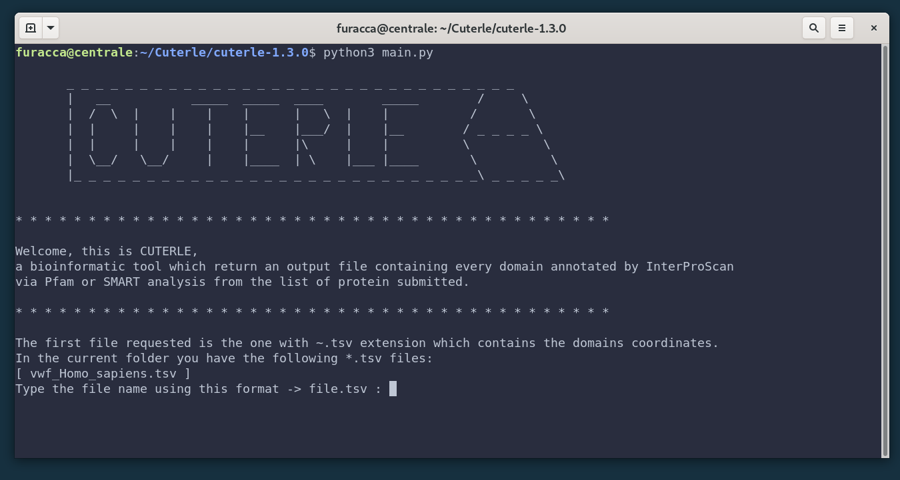

<p align="center"></p>

# Cuterle
Cuterle is a bioinformatic tool which return an output file (`extracted_domain.fasta`) containing every domain annotated by [InterProScan](https://www.ebi.ac.uk/interpro/) (`~.tsv file`) via Pfam or SMART from the list of protein (`~.fasta file`) submitted.


# Getting started

## Prerequisites

- Python3
- pip

## Installation of the Python required packages

Install the required Python packages; while you are in the project's root directory run the following command:

```bash
# Install requirements
pip install -r requirements.txt
```

## Usage

In terminal, run the following command. By default, this will only retrieve Bulbasaur.

```bash
# Run Cuterle
python3 main.py
```




Once you run main.py in terminal, the program request the two input file (~.tsv and ~.fasta).<br>
For every input file there is a check which guarantee its existence and the right format. <br>
**Please be sure to use the right format**


# Next updates

**TOP PRIORITY**
- Enable python argument command line to be bash script friendly (work in progress)

**MEDIUM PRIORITY**
- Use some nice color to draw the domains (same domain, same color)

**OTHER**
- Possibily of choice for the name of sequences in fasta output
- Possibily of choice for the order of domain (decrescent order for number of domain or for the id?)
- Choice the domain of interest to be saved in the output file
- Print max 10 item from the files' list in the folder
- Nicer interface (only at the end)


